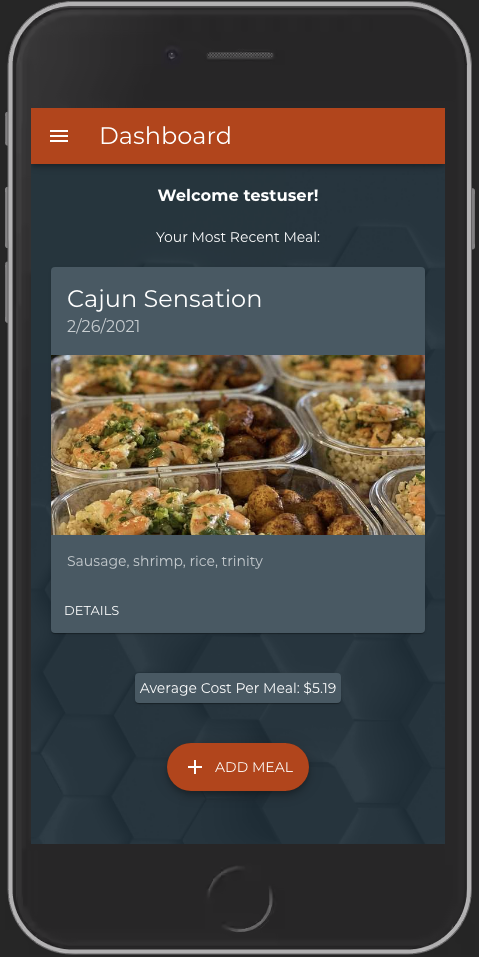
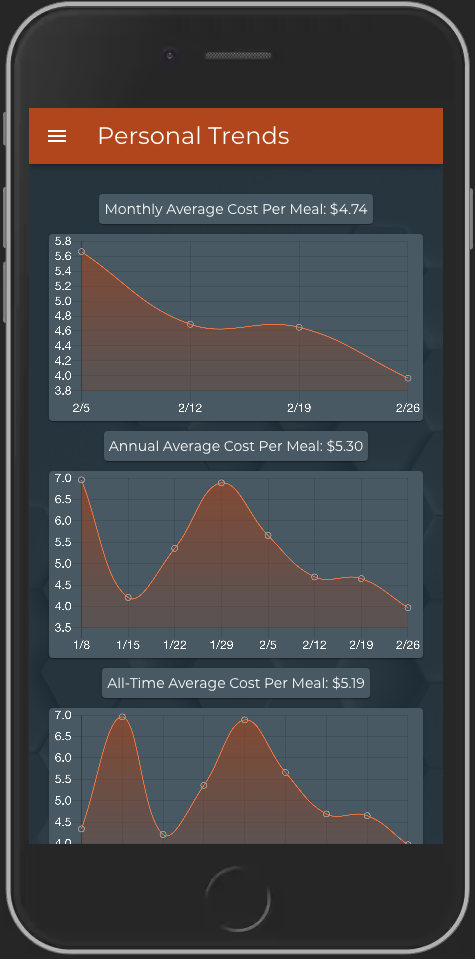

# foodCost

## Description

_Duration: 2 Week Sprint_

FoodCost is an app that allows registered users to record the cost of their weekly meal prep and track the trends of their Cost Per Meal. Users input the ingredients purchased for their weekly session, with prices and quantity used. Each meal can be given a name and brief description, as well as an image, and the total number of portions made. These can be edited if they need to be updated, or removed as the user sees fit. The app is built using responsive, mobile first design, and sleek styling, to appeal to a diverse user base.

To see the fully functional site, please visit: [Heroku](https://vast-retreat-50324.herokuapp.com/#/)

## Screen Shots

### Prerequisites

- [Node.js](https://nodejs.org/en/)

## Installation

1. Create a database named `foodCost`,
2. The queries in the `database.sql` file are set up to create all the necessary tables and populate the needed data to allow the application to run correctly. The project is built on [Postgres](https://www.postgresql.org/download/), so you will need to make sure to have that installed. I recommend using Postico to run those queries as that was used to create the queries, 
3. Open up your editor of choice and run an `npm install`
4. Run `npm run server` in your terminal
5. Run `npm run client` in your terminal
6. The `npm run client` command will open up a new browser tab for you!

## Usage
How does someone use this application? Tell a user story here.

1. Register a new account
2. Add your first meal
3. Continue to add meals as needed
4. Use the trends view to see how the meals costs compare
5. Edit or delete meals as needed from the details view

## Built With

React
Redux
Redux Saga
React-ChartJS-2
Passport
Express
Axios
BCryptJS
PostgreSQL
Material UI
Heroku 

## Acknowledgement
Thanks to [Prime Digital Academy](www.primeacademy.io) who equipped and helped me to make this application a reality.

## Support
If you have suggestions or issues, please email me at [dunnmj42@gmail.com](mailto:dunnmj42@gmail.com)